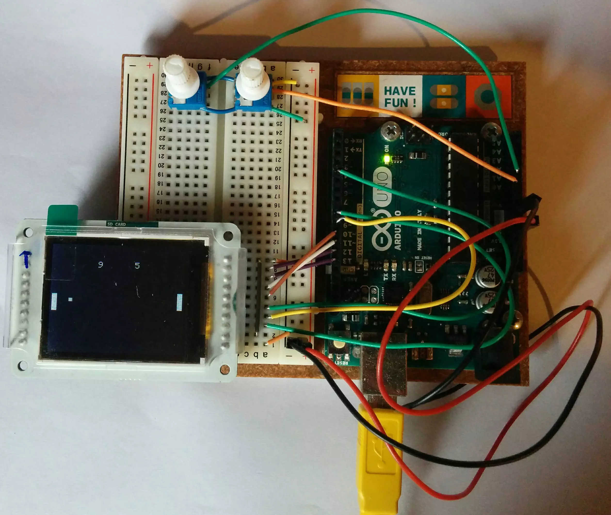

Arduino Pong
=======

The Project
-----------

In this project i implemented Pong from scratch for an Arduino Uno with an [Arduino TFT](https://www.arduino.cc/en/Guide/TFT).

The project goals are the following:

-   Learn about programming for embedded hardware (Arduino)
-   Generally raise my programming experience

This project is licensed under the terms of the MIT license. See [LICENSE](LICENSE).

### Tools

The project uses the following tools and libraries:

*   CMake with [Arduino CMake](https://github.com/queezythegreat/arduino-cmake)
*   Arduino SDK and TFT library
*   [doctest](https://github.com/onqtam/doctest) for unit tests

Arduino CMake uses gcc-avr to compile the c++ code. This means that exceptions are disabled by default (-fno-exceptions).

The following restrictions are also applied:

*   No use of RTTI (-fno-rtti). RTTI costs time and space. I don’t plan to use any or much inheritance.
*   No dynamic memory allocation. While Arduino supports `operator new`, i will not use it.

### The Game and Design

The initial design for the project can be found [here](design/arduino_pong_design.md). Some things might be different in the code then presented there.

### Finished setup

(Yes, the buttons are above the screen. At first, i did not know the correct orientation of the screen. While it's possible to change the orientation programmaticically, i decided to leave it like this.)

#### Hardeware Setup

The TFT screen was connected using the instructions [here](https://www.arduino.cc/en/Guide/TFTtoBoards). Two potentiometers control the paddles. They are connected to the analog pins `A0` and `A1` respectively.
