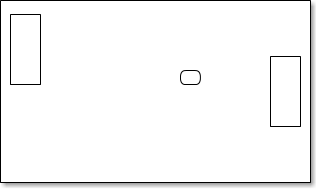
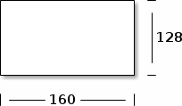
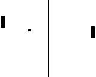
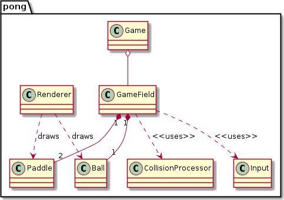
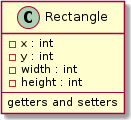
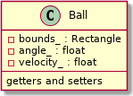
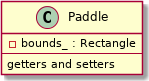
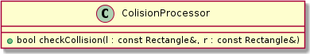
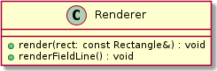

Arduino Pong Design
=======

Table of Contents
-----------------
-   [Pong](#pong)
    -   [Details](#details)
-   [Implementation Design](#implementation-design)
    -   [Classes](#classes)
        -   [Game](#game)
        -   [GameField](#gamefield)
        -   [Ball and Paddle](#ball-and-paddle)
        -   [CollisionProcessor](#collisionprocessor)
        -   [Renderer](#renderer)

Pong
----



Pong is a simple game the players control paddles to hit the ball back to the opponent. If a player fails to catch the ball, the opponent receives one point. The points if the player are shown as text inside the players field.

The following objects make up the game:

-   Two paddles
-   A ball

### Details

Since the ball can hit the paddles, collision checks need to be performed. The original Pong had segmented paddles. The segment the ball hits determents the return angle of the ball. Hitting the ball with the center of the paddle returns the ball with an 90° angle. Other parts of the paddle return the ball at smaller angles.

The Game is targeted to run on the Arduino TFT. This means that the dimensions of the screen are known beforehand and will never change. Compared to desktop development, this makes things easier. The screen has dimensions of 160 x 128 :



We can now define:

**Paddle**  
-   Width: 6px
-   Height: 20px

**Ball**  
-   Width: 4px
-   Height: 4px

The following shows the relative sizes of the objects:



Implementation Design
=====================

Classes
-------

The high level design is shown in the following diagram:



### Game

](source/figures/gen/uml_game.png)

The Game class includes the [Game Loop](http://gameprogrammingpatterns.com/game-loop.html). It has an instance of [GameField](#gamefield) and will call `update()` and `render()` methods on it. `run()` will be directly called from `main` and represents the main loop of the program.

Pseudo code:

``` cpp
void Game::run()
{
    gameField_.update();
    gameField_.render(renderer_);
}
```

### GameField

](source/figures/gen/uml_gamefield.png)

GameField represents the pong field. It contains the ball and the paddles. In `update()` and `render()` it handles movement and collision of the ball and the paddles. The `render()` method uses the `Renderer` to draw the ball and paddles on the screen.

Pseudo code:

``` cpp
void GameField::update()
{
    movePaddlesAccordingToInput();
    moveBall();
    checkBallCollision();
}
void GameField::render(Renderer& renderer)
{
    renderer.render(ball_);
    renderer.render(paddles_[0]);
    renderer.render(paddles_[1]);
}
```

### Ball and Paddle

We can model both of these with rectangles. In addition of width and height, the Rectangle class gets x and y for position:



Ball and Paddle are then defined as follows:





### CollisionProcessor



Checks collisions between rectangles. `checkCollision()` checks if the two rectangles collide in any way. This includes one rectangle being contained in another.

### Renderer



Renderer renders various thing to the screen.
